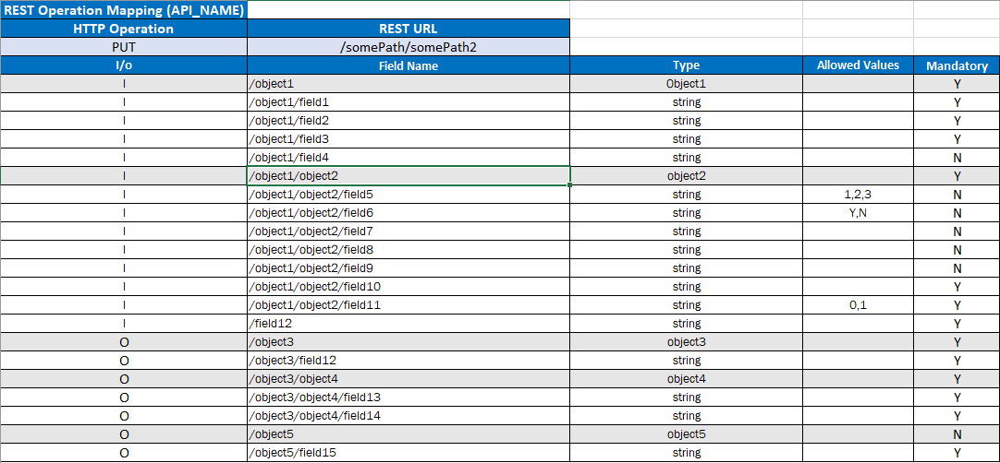
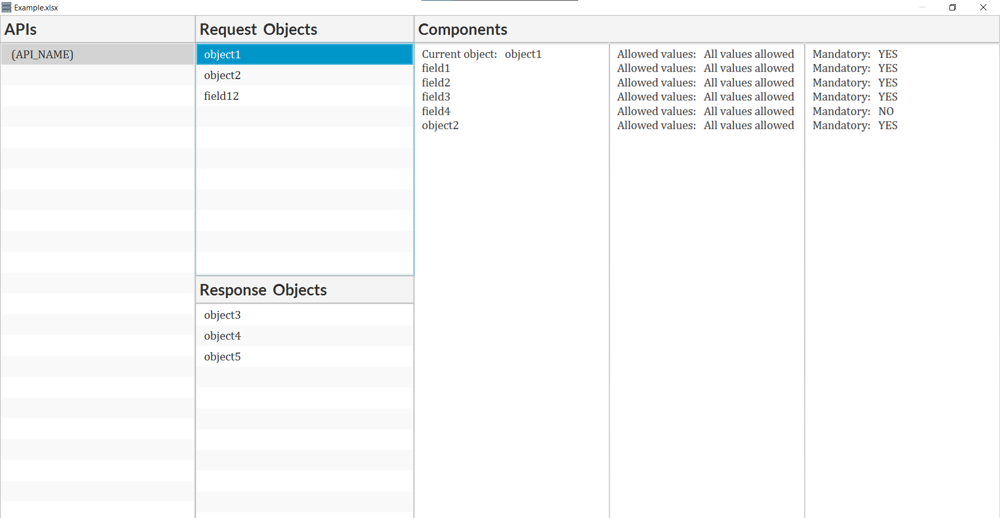

## Project description.
A Java program that reads the Excel file and identifies main objects in the request and response of a given proposed API(s).

###  Dependencies:
+ JavaFx 11
+ Apache POI 5.2.2

### Sample input:

### Sample output:

## Contributors
| Name                     | ID       |
|:-------------------------|----------|
| Ahmed Khaled Mohamed     | 1901275  |
| Omar Mohamed Fahmy       | 1901299  |
| Malek Abdelrahman Hassan | 1901104  |